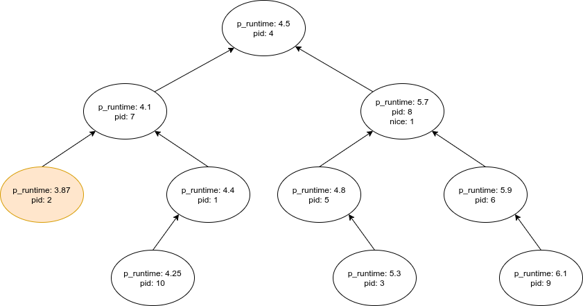
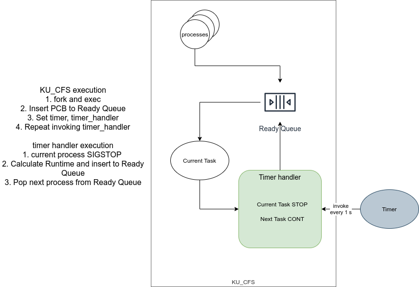

# KU-CFS
Completely Fair Scheduler user-level implement written in C using Red Blak Tree.


## Ready Queue


## Execution



## Build and run
```bash
$ gcc -o ku_app ku_app.c
$ gcc -o ku_cfs ku_cfs.c
$ ./ku_cfs 0 1 2 0 0 30
```

## LICENSE
- MIT
